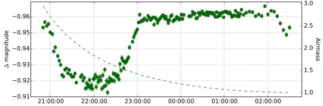

.. LEMON documentation master file, created by
   sphinx-quickstart on Mon May  6 12:08:02 2013.
   You can adapt this file completely to your liking, but it should at least
   contain the root `toctree` directive.

LEMON: differential photometry
==============================

LEMON is a scientific pipeline, written in Python_, that determines the changes in the brightness of astronomical objects over time and compiles their measurements into `light curves`_. The aim of this program is to make it possible to completely **reduce thousands of FITS images of time series** in a matter of only a few hours, requiring minimal user interaction.

For example, to get the light curve of a transit of WASP-10b_:

::

    $ lemon astrometry data/*.fits WASP10/
    $ lemon mosaic WASP10/*.fits WASP10-mosaic.fits
    $ lemon photometry WASP10-mosaic.fits WASP10/*.fits phot.LEMONdB
    $ lemon diffphot phot.LEMONdB curves.LEMONdB

The above commands produce, among many others, the following plot:

LEMON aims at taking most of the burden out of the astronomer, working out of the box with any set of images that conform to the `FITS standard`_. In most scenarios, the above four commands are enough to generate the high-precision light curves of all your astronomical objects.

.. _Python: https://www.python.org/
.. _light curves: https://en.wikipedia.org/wiki/Light_curve
.. _WASP-10b: http://exoplanet.eu/catalog/wasp-10_b/
.. _FITS standard: http://fits.gsfc.nasa.gov/fits_standard.html

User Guide
==========

.. toctree::
   :maxdepth: 1
