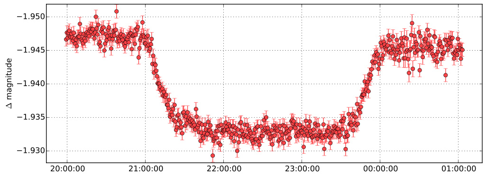

LEMON
=====

LEMON_ is a differential-photometry pipeline, written in Python_, that determines the changes in the brightness of astronomical objects over time and compiles their measurements into `light curves`_. The aim of this program is to make it possible to completely reduce thousands of FITS images of time series in a matter of only a few hours, requiring minimal user interaction.

For example, to get the light curve of a transit of HAT-P-16b_:

::

    $ lemon astrometry data/*.fits HAT-P-16/
    $ lemon mosaic HAT-P-16/*.fits HAT-P-16-mosaic.fits
    $ lemon photometry HAT-P-16-mosaic.fits HAT-P-16/*.fits phot.LEMONdB
    $ lemon diffphot phot.LEMONdB curves.LEMONdB

The above commands produce, among many others, the following plot:

Homepage
--------

http://lemon.readthedocs.org/

Acknowledging us
----------------

If you use LEMON, please cite the package via its Zenodo_ record.

.. image:: https://zenodo.org/badge/4550305.svg
   :target: https://zenodo.org/badge/latestdoi/4550305

Project Status
--------------

.. image:: https://travis-ci.org/vterron/lemon.png?branch=master
   :target: https://travis-ci.org/vterron/lemon

.. image:: https://img.shields.io/badge/code%20style-black-000000.svg
   :target: https://github.com/psf/black

.. _LEMON: https://lemon.readthedocs.org/
.. _Python: https://www.python.org/
.. _light curves: https://en.wikipedia.org/wiki/Light_curve
.. _HAT-P-16b: http://exoplanet.eu/catalog/hat-p-16_b/
.. _Zenodo: https://zenodo.org/
