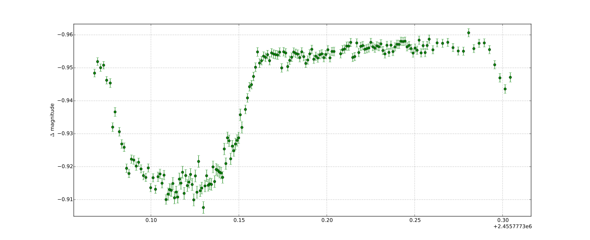

# WASP-10b integration test

LEMON has [an integration test](./wasp10b.py) that reduces a transit of exoplanet [WASP-10b](https://en.wikipedia.org/wiki/WASP-10b), comparing the resulting light curve to that in a [golden file](./WASP10b-golden-curve.txt). Although this test doesn't exercise the entire pipeline, it covers the two critical commands: `photometry` (to perform aperture photometry) and `diffphot` (to generate the light curves). These are the steps that the integration test follows:

1. Downloads a 2.3 GiB `.xz` file with [the test data](#test-data).
   * The URL of the file is read from the `WASP10_URL` environment variable.
1. Extracts and verifies the SHA-1 checksums of the test data.
1. Runs `lemon photometry` on the test FITS images.
   * Instead of relying on [SExtractor](http://www.astromatic.net/software/sextractor) for the detection of stars, we use a [hand-curated list](./WASP10b-coordinates.txt) of just 58 stars in the field of view. This considerably improves the execution time of the light curve generation (in the subsequent step), given the quadratic complexity of [Broeg's algorithm](http://adsabs.harvard.edu/abs/2005AN....326..134B).
1. Runs `lemon diffphot`, generating the light curve of all the objects.
1. Runs `lemon export`, writing the light curve of WASP-10 to a text file.
1. Compares the exported light curve to those in [the golden file](./WASP10b-golden-curve.txt).
   * For each data point, compares three values: Julian Date, differential magnitude and signal-to-noise ratio.
   * For each (floating-point) value, uses [`assertAlmostEqual()`](https://docs.python.org/3/library/unittest.html#unittest.TestCase.assertAlmostEqual) with `places=6`.

The light curve is generated for multiple values of `--cores`, including a single CPU. This exercises the multiprocessing logic, making sure that light curves generated in parallel are absolutely independent of each other: the resulting light curves are always the same, regardless of the number of CPUs among which the work was divided.

This integration test is part of [our Travis CI configuration](../.travis.yml), and thus runs automatically for any code change.

## Test data

The FITS files used in the integration test are 182 images of a transit of [exoplanet WASP-10b](https://en.wikipedia.org/wiki/WASP-10b). These images were taken by our team with [the 1.5 telescope](https://www.osn.iaa.csic.es/en/page/15-m-telescope) at the [Sierra Nevada Observatory](https://www.osn.iaa.csic.es/en/) (Granada, Spain) on August 4th 2011. The data is compressed into a 2.3 GiB `.xz` file stored on @vterron's [NextCloud](https://nextcloud.com/) server. For this reason, the URL of the file is stored in [an encrypted environment variable](https://docs.travis-ci.com/user/environment-variables/#defining-encrypted-variables-in-travisyml), and not publicly available. Although not infallible, the goal of this approach is merely to avoid unnecesarily exposing the address of a personal NextCloud server.

### Obtaining a copy

If you'd like to download a copy of WASP-10b's transit FITS images, please [file an issue](https://github.com/vterron/lemon/issues/new) and we'll share them with you.

### Plotting the exoplanet transit

This is what the WASP-10b's transit in [the golden file](./WASP10b-golden-curve.txt) looks like:

